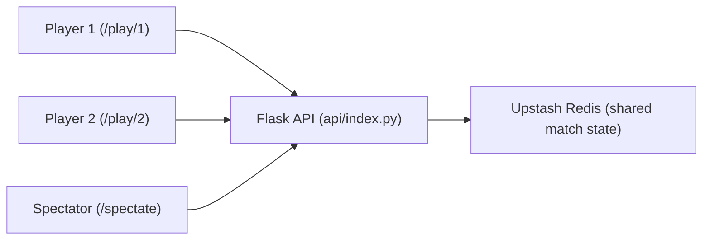

# Word Hunt Tournament (Flask + Vercel) - Lesson README

This project is a two-player Word Hunt clone built for live club tournaments.
It is also a teaching project: the code is intentionally structured so beginner game developers can follow it.

You get three views:

- `/play/1` for Player 1
- `/play/2` for Player 2
- `/spectate` for the live host/spectator screen

## What This Teaches

- How to model game state on a server
- How to separate "game rules" from "UI rendering"
- How to validate player actions fairly on the backend
- How to keep multiple clients synchronized in real time
- Why serverless apps need shared storage for multiplayer state

## Quick Tournament Host Flow

1. Open `/spectate` on the main display.
2. Click `Create Match`.
3. Open Player 1 and Player 2 links from the spectator screen.
4. Players join automatically.
5. Click `Start Match` on spectator.
6. Match runs for 90 seconds.
7. Winner/tie summary appears when time expires.

## Architecture at a Glance



## Project Map

- `api/index.py`: backend game logic, rules, state, API routes
- `static/player.js`: player input, swipe tracing, polling, word submit
- `static/spectator.js`: host controls, side-by-side live boards, polling
- `static/styles.css`: all styling and layout
- `templates/*.html`: the three page views
- `data/words.txt`: dictionary used for validation
- `vercel.json`: Vercel route/build config

## Core Game State Model

The match state is created in `new_match()` in `api/index.py` and includes:

- `id`: unique match id
- `board`: 4x4 letter grid
- `status`: `waiting`, `running`, or `finished`
- `start_time`, `duration`, `time_remaining`
- `players`: join status, score, words found, last points
- `active_swipes`: live tracing paths/words for spectator visualization

Think of this as the "single source of truth" for the whole game.

## Backend Lesson: Where the Rules Live

All actual game rules are backend-enforced in `api/index.py`.

### 1. Board Generation

- `generate_board()` shuffles classic Boggle dice and picks one face per die.
- This gives each match a fresh randomized 4x4 board.

### 2. Scoring

- `score_word(word_len)` implements Word Hunt scoring:
  - 3 letters = 100
  - 4 = 400
  - 5 = 800
  - 6 = 1400
  - 7 = 1800
  - 8+ = 2200 + 400 per extra letter

### 3. Word Validity

- `normalize_word()` removes non-letters and lowercases.
- Dictionary check uses `WORD_SET` loaded from `data/words.txt`.
- `word_on_board()` uses DFS to ensure the word can actually be formed from adjacent cells.
- Duplicate words per player are rejected.

### 4. Match Lifecycle

- `update_match_status()` flips running -> finished when time hits 0.
- `winner_info()` computes winner or tie and summary text.

### 5. API Endpoints

- `POST /api/new-match`: reset to a fresh match
- `POST /api/join`: mark player joined
- `POST /api/start-match`: start timer if both joined
- `POST /api/submit`: validate word + award points
- `POST /api/swipe-update`: store live swipe path for spectator
- `GET /api/state`: return state snapshot for player or spectator

## Frontend Lesson: What the Clients Do

### Player Client (`static/player.js`)

- Renders board and trace overlay
- Captures swipe/touch path across adjacent tiles
- Sends live swipe path to `/api/swipe-update`
- Sends finished word to `/api/submit`
- Polls `/api/state` frequently to keep score/timer/status current

Important concept:

- The player client does input and rendering.
- The backend decides if a word is valid and whether points are awarded.

### Spectator Client (`static/spectator.js`)

- Controls match flow (create/start/reset)
- Shows both players side-by-side
- Shows real-time swipe traces and words
- Polls `/api/state` to stay live

## Why Redis Is Used (Important Multiplayer Lesson)

Vercel serverless functions do not share Python memory across instances.
If match state only lives in a global Python variable, clients can desync.

So this project stores state in Upstash Redis:

- `REDIS_URL` / `KV_URL` for connection
- one key for match state (`wordhunt:match_state:v1`)
- one lock key (`wordhunt:match_lock:v1`) to avoid race conditions

This is the most important infrastructure fix for reliable multiplayer behavior.

## End-to-End Example Round

1. Spectator creates a match (`/api/new-match`)
2. Players open links with the match id and join (`/api/join`)
3. Spectator starts match (`/api/start-match`)
4. Player swipes:
   - live path posted to `/api/swipe-update`
   - completed word posted to `/api/submit`
5. Backend validates and updates score
6. All screens poll `/api/state` and re-render
7. Timer expires -> backend marks finished -> winner/tie shown

## Tie Handling

Tie logic is implemented in `winner_info()` in `api/index.py`.
If scores are equal, the result is:

- `winner: "tie"`
- summary includes both scores and both word counts

## Local Development

```bash
python3 -m venv .venv
source .venv/bin/activate
pip install -r requirements.txt
python api/index.py
```

Open `http://127.0.0.1:5000`.

If you want local Redis behavior too:

```bash
vercel env pull
```

This creates `.env.local` with `REDIS_URL` / `KV_URL`.

## Deploy to Vercel

1. Push this repo to GitHub.
2. Import project into Vercel.
3. Add Upstash for Redis integration to the project.
4. Deploy.

This repo already includes `vercel.json`, so no custom build command is needed.

## Teaching Script (10-Minute Breakdown)

Use this in your meeting:

1. "This object is the whole game state."
2. "These endpoints are the game loop."
3. "Frontend only sends intent; backend enforces rules."
4. "DFS checks if a word can be formed on the board."
5. "Redis is what makes multiplayer consistent on serverless."

## Extension Ideas for Club Members

- Add rematch history and leaderboard persistence
- Add ranked best-of-3 mode
- Add anti-cheat analytics (word speed, impossible traces)
- Add WebSocket mode instead of polling
- Add custom board modes (themed dice, larger grids)
